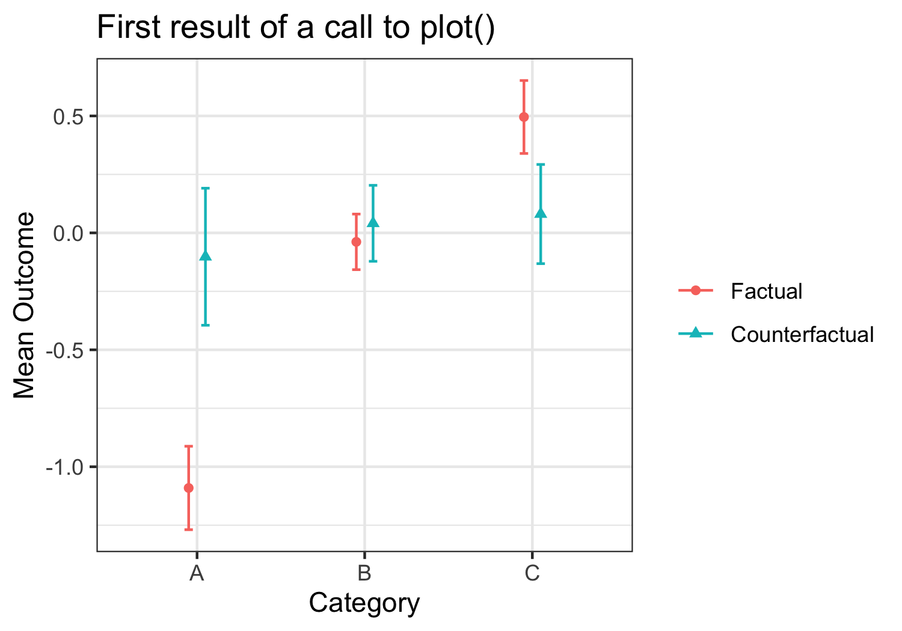
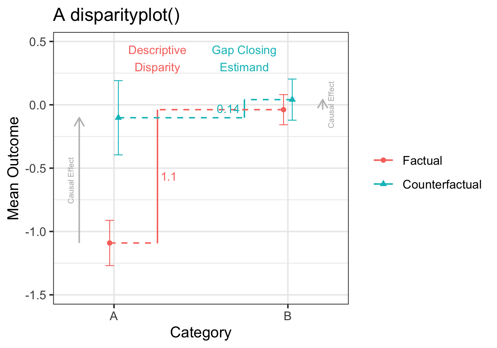
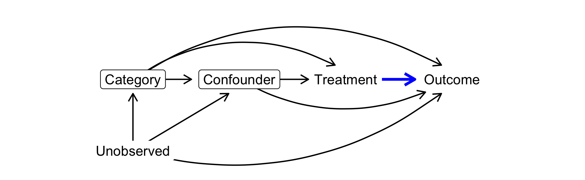
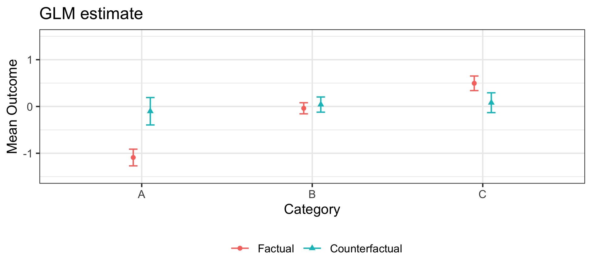
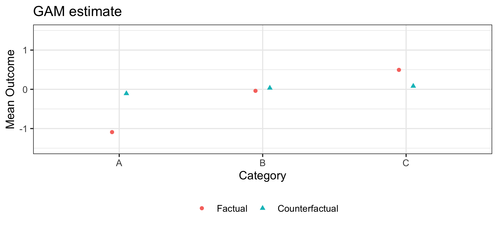
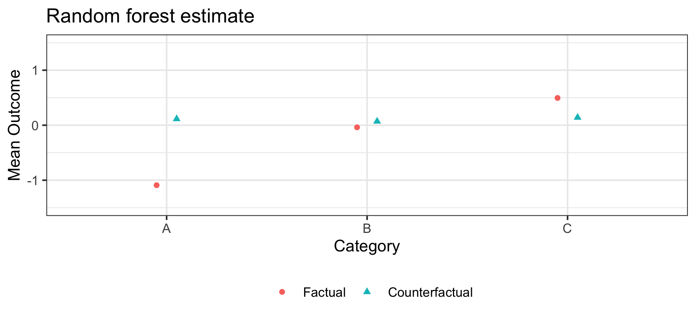
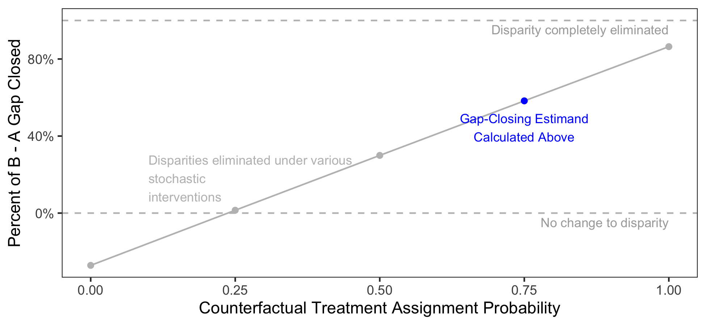

gapclosing: An R package to estimate gap closing estimands
================


- <a href="#overview-of-the-goal" id="toc-overview-of-the-goal">Overview
  of the goal</a>
- <a href="#1-data-structure" id="toc-1-data-structure">1. Data
  structure</a>
  - <a href="#aside-learning-the-basic-concept-outside-the-package"
    id="toc-aside-learning-the-basic-concept-outside-the-package">Aside:
    Learning the basic concept outside the package</a>
- <a href="#2-quick-overview-package-functionality"
  id="toc-2-quick-overview-package-functionality">2. Quick overview:
  Package functionality</a>
- <a href="#3-detailed-procedures-customize-your-call"
  id="toc-3-detailed-procedures-customize-your-call">3. Detailed
  procedures: Customize your call</a>
  - <a href="#step-1-define-the-intervention"
    id="toc-step-1-define-the-intervention">Step 1. Define the
    intervention</a>
  - <a href="#step-2-make-causal-assumptions-for-identification"
    id="toc-step-2-make-causal-assumptions-for-identification">Step 2. Make
    causal assumptions for identification</a>
  - <a href="#step-3-specify-a-treatment-model-andor-an-outcome-model"
    id="toc-step-3-specify-a-treatment-model-andor-an-outcome-model">Step 3.
    Specify a treatment model and/or an outcome model</a>
    - <a href="#choose-an-estimation-algorithm"
      id="toc-choose-an-estimation-algorithm">Choose an estimation
      algorithm</a>
    - <a href="#why-doubly-robust-a-side-note"
      id="toc-why-doubly-robust-a-side-note">Why doubly robust? A side
      note</a>
    - <a href="#why-sample-splitting-another-side-note"
      id="toc-why-sample-splitting-another-side-note">Why sample splitting?
      Another side note</a>
    - <a href="#produce-standard-errors"
      id="toc-produce-standard-errors">Produce standard errors</a>
- <a href="#4-estimate-by-machine-learning-two-examples"
  id="toc-4-estimate-by-machine-learning-two-examples">4. Estimate by
  machine learning: Two examples</a>
  - <a href="#estimation-with-generalized-additive-models-gams-via-mgcv"
    id="toc-estimation-with-generalized-additive-models-gams-via-mgcv">Estimation
    with Generalized Additive Models (GAMs) via <code>mgcv</code></a>
  - <a href="#estimation-with-random-forests-via-ranger"
    id="toc-estimation-with-random-forests-via-ranger">Estimation with
    random forests via <code>ranger</code></a>
  - <a href="#estimates-from-these-three-algorithms-are-roughly-the-same"
    id="toc-estimates-from-these-three-algorithms-are-roughly-the-same">Estimates
    from these three algorithms are roughly the same</a>
  - <a href="#a-warning-about-complex-estimators"
    id="toc-a-warning-about-complex-estimators">A warning about complex
    estimators</a>
- <a href="#5-estimate-with-stochastic-assignment-rules"
  id="toc-5-estimate-with-stochastic-assignment-rules">5. Estimate with
  stochastic assignment rules</a>
- <a href="#6-conclusion" id="toc-6-conclusion">6. Conclusion</a>
- <a href="#references" id="toc-references">References</a>

<style type="text/css">
code.r{
  font-size: 12px;
}
pre {
  font-size: 12px
}
</style>

To use this tutorial, you should install the `gapclosing` R package.

``` r
install.packages("gapclosing")
```

For more info, visit
[ilundberg.github.io/gapclosing/](https://ilundberg.github.io/gapclosing/).

# Overview of the goal

Gaps across social categories like race, class, and gender are important
to understand. We would like to know whether there is anything we can do
to close these gaps. What if we intervened to reduce incarceration or
increase access to education? Would those interventions close gaps
across categories of race, class, or gender?

These types of questions are at the core of a growing literature in
epidemiology addresses these questions with techniques for causal
decomposition analysis (VanderWeele and Robinson (2014), Jackson and
VanderWeele (2018), Jackson (2020)). The paper which accompanies this
software package introduces these methods to a broader set of social
scientists.

> Lundberg, Ian. 2022. “The gap-closing estimand: A causal approach to
> study interventions that close disparities across social categories.”
> *Sociological Methods and Research*. [\[published
> version\]](https://doi.org/10.1177/00491241211055769) [\[open access
> preprint\]](https://doi.org/10.31235/osf.io/gx4y3)
> [\[software\]](https://ilundberg.github.io/gapclosing/).

This package provides software to support inquiry into gap-closing
estimands. A guiding principle is to partition the tasks the human user
must do from the tasks that the package can automate.

The human user must carry out these tasks:

- Define the intervention
- Make causal assumptions for identification
- Specify a treatment model and/or an outcome model

Given those inputs, the package will automatically:

- Estimate models (GLM, GAM, ridge regression, or random forest)
- Convert models to doubly-robust estimates of gap-closing estimands,
  using sample splitting to improve convergence
- Estimate standard errors by bootstrapping
- Visualize the result

The structure of the vignette is as follows.

1.  Data structure
2.  Quick overview: Functionality
3.  Detailed procedures: Customize your call
    - Define the intervention
    - Make causal assumptions for identification
    - Specify a treatment model and/or an outcome model
4.  Estimate by machine learning: Two examples
5.  Estimate with stochastic assignment rules
6.  Conclusion

# 1. Data structure

In a data frame `data`, we have a gap-defining category such as race,
gender, or class. We have a binary treatment variable that could have
counterfactually been different for any individual. We want to know the
degree to which an intervention to change the treatment would close gaps
across the categories.

> **These boxes will present an example.**
>
> *Example.* Suppose we have the following data.
>
> - $X$ (`category`): Category of interest, taking values {A, B, C}
> - $T$ (`treatment`): Binary treatment variable, taking values 0 and 1
> - $L$ (`confounder`): A continuous confounding variable, Uniform(-1,1)
> - $Y$ (`outcome`): A continuous outcome variable, conditionally normal

``` r
set.seed(08544)
library(gapclosing)
library(dplyr)
library(ggplot2)
```

``` r
simulated_data <- generate_simulated_data(n = 1000)
head(simulated_data)
```

    ##   category confounder treatment    outcome
    ## 1        C   1.640509         1 -0.7970377
    ## 2        B   1.032373         0  1.9304909
    ## 3        C   2.217630         1 -0.2009803
    ## 4        A  -1.642914         0 -0.5015702
    ## 5        A  -1.844897         0 -1.2027025
    ## 6        A  -2.415100         0 -3.9288188

## Aside: Learning the basic concept outside the package

With the most simple models, you can carry out a gap-closing analysis
without the software package. First, fit any prediction function for the
outcome as a function of the category of interest, confounders, and
treatment.

``` r
example_ols <- lm(outcome ~ category*treatment + confounder,
                  data = simulated_data)
```

For everyone in the sample, predict under a counterfactual treatment
value (e.g., `treatment = 1`).

``` r
fitted <- simulated_data %>%
  mutate(outcome_under_treatment_1 = predict(example_ols,
                                             newdata = simulated_data %>%
                                               mutate(treatment = 1)))
```

Average the counterfactual estimates within each category.

``` r
fitted %>%
  # Group by the category of interest
  group_by(category) %>%
  # Take the average prediction
  summarize(factual = mean(outcome),
            counterfactual = mean(outcome_under_treatment_1))
```

    ## # A tibble: 3 × 3
    ##   category factual counterfactual
    ##   <chr>      <dbl>          <dbl>
    ## 1 A        -1.09           0.0488
    ## 2 B        -0.0384        -0.0370
    ## 3 C         0.495          0.132

The software package supports these steps as well as more complex things
you might want:

- three estimation strategies
  - outcome prediction
  - treatment prediction
  - doubly robust estimation
- machine learning prediction functions
- counterfactual treatments that differ across units
- bootstrapping for standard errors
- easy visualization

# 2. Quick overview: Package functionality

The `gapclosing()` function estimates gaps across categories and the
degree to which they would close under the specified
`counterfactual_assignments` of the treatment.

``` r
estimate <- gapclosing(
  data = simulated_data,
  counterfactual_assignments = 1,
  outcome_formula = formula(outcome ~ confounder + category*treatment),
  treatment_formula = formula(treatment ~ confounder + category),
  category_name = "category",
  se = TRUE,
  # Setting bootstrap_samples very low to speed this tutorial
  # Should be set higher in practice
  bootstrap_samples = 20,
  # You can process the bootstrap in parallel with as many cores as available
  parallel_cores = 1
)
```

    ## Warning in gapclosing(data = simulated_data, counterfactual_assignments = 1, :
    ## You have asked for bootstrap standard errors (se = TRUE) but you have set
    ## bootstrap_samples to fewer than 1,000. Although the necessary number of
    ## bootstrap samples will differ across applications, you may need to consider
    ## increasing bootstrap_samples.

By default, this function will do the following:

- Fit logistic regression to predict treatment assignment
- Fit OLS regression to predict outcomes
- Combine the two in a doubly-robust estimator estimated on a single
  sample
- Return a `gapclosing` object which supports `summary`, `print`, and
  `plot` functions.

In this example, the `plot(estimate)` function produces the following
visualization. The factual outcomes are unequal across categories, but
the counterfactual outcomes are roughly equal. In this simulated
setting, the intervention almost entirely closes the gaps across the
categories.

<div class="figure">


<p class="caption">
Figure 1 produced by plot() function
</p>

</div>

The `disparityplot()` function lets us zoom in on the factual and
counterfactual disparity between two categories, of interest. In this
case, we see that the intervention lifts outcomes in category A to be
more comparable to category B. A `disparityplot` is a `ggplot2` object
and can be customized by passing additional layers.

<div class="figure">


<p class="caption">
Figure 1 produced by plot() function
</p>

</div>

The `summary` function will print estimates, standard errors, and
confidence intervals for all of these results.

``` r
summary(estimate)
```

    ## Gap-closing estimates using doubly_robust estimation on one sample.
    ## 
    ## Treatment model was glm estimation with model formula:
    ## formula(treatment ~ confounder + category)
    ## 
    ## Outcome model was lm estimation with model formula:
    ## formula(outcome ~ confounder + category * treatment)
    ## 
    ## Factual estimates are means within and disparities across category.
    ## Counterfactual estimates are under an intervention to set  to 1.
    ## Standard errors are calculated from 20 bootstrap samples.
    ## 
    ## Factual mean outcomes:
    ## # A tibble: 3 × 5
    ##   category estimate     se ci.min  ci.max
    ##   <chr>       <dbl>  <dbl>  <dbl>   <dbl>
    ## 1 A         -1.09   0.0910 -1.27  -0.912 
    ## 2 B         -0.0384 0.0606 -0.157  0.0804
    ## 3 C          0.495  0.0796  0.340  0.651 
    ## 
    ## Counterfactual mean outcomes (post-intervention means):
    ## # A tibble: 3 × 5
    ##   category estimate     se ci.min ci.max
    ##   <chr>       <dbl>  <dbl>  <dbl>  <dbl>
    ## 1 A         -0.102  0.149  -0.395  0.191
    ## 2 B          0.0409 0.0828 -0.121  0.203
    ## 3 C          0.0805 0.108  -0.132  0.293
    ## 
    ## Factual disparities:
    ## # A tibble: 6 × 5
    ##   category estimate     se ci.min ci.max
    ##   <chr>       <dbl>  <dbl>  <dbl>  <dbl>
    ## 1 A - B      -1.05  0.123  -1.29  -0.811
    ## 2 A - C      -1.59  0.135  -1.85  -1.32 
    ## 3 B - A       1.05  0.123   0.811  1.29 
    ## 4 B - C      -0.534 0.0885 -0.707 -0.360
    ## 5 C - A       1.59  0.135   1.32   1.85 
    ## 6 C - B       0.534 0.0885  0.360  0.707
    ## 
    ## Counterfactual disparities (gap-closing estimands):
    ## # A tibble: 6 × 5
    ##   category estimate    se ci.min ci.max
    ##   <chr>       <dbl> <dbl>  <dbl>  <dbl>
    ## 1 A - B     -0.143  0.188 -0.510  0.225
    ## 2 A - C     -0.183  0.160 -0.496  0.131
    ## 3 B - A      0.143  0.188 -0.225  0.510
    ## 4 B - C     -0.0396 0.128 -0.290  0.210
    ## 5 C - A      0.183  0.160 -0.131  0.496
    ## 6 C - B      0.0396 0.128 -0.210  0.290
    ## 
    ## Additive gap closed: Counterfactual - Factual
    ## # A tibble: 6 × 5
    ##   category estimate     se ci.min ci.max
    ##   <chr>       <dbl>  <dbl>  <dbl>  <dbl>
    ## 1 A - B      -0.909 0.199  -1.30  -0.519
    ## 2 A - C      -1.40  0.172  -1.74  -1.07 
    ## 3 B - A       0.909 0.199   0.519  1.30 
    ## 4 B - C      -0.494 0.0965 -0.684 -0.305
    ## 5 C - A       1.40  0.172   1.07   1.74 
    ## 6 C - B       0.494 0.0965  0.305  0.684
    ## 
    ## Proportional gap closed: (Counterfactual - Factual) / Factual
    ## # A tibble: 6 × 5
    ##   category estimate     se ci.min ci.max
    ##   <chr>       <dbl>  <dbl>  <dbl>  <dbl>
    ## 1 A - B       0.864 0.169   0.534   1.19
    ## 2 A - C       0.885 0.0968  0.695   1.07
    ## 3 B - A       0.864 0.169   0.534   1.19
    ## 4 B - C       0.926 0.258   0.420   1.43
    ## 5 C - A       0.885 0.0968  0.695   1.07
    ## 6 C - B       0.926 0.258   0.420   1.43
    ## 
    ## Type plot(name_of_this_object) to visualize results.

# 3. Detailed procedures: Customize your call

This section provides a more detailed overview of the use of
`gapclosing()`. It is structured from the perspective of the three key
tasks for the researcher: define the intervention, make causal
assumptions for identification, and specify a treatment and/or outcome
model. Along the way, this section introduces many of the possible
arguments in a `gapclosing()` call.

## Step 1. Define the intervention

To answer a gap-closing question, we first need to define what that
intervention would be. To what treatment value would units be
counterfactually assigned? There are several options.

- **Option 1.** Set `counterfactual_assignments = 0` or
  `counterfactual_assignments = 1`. In this case, we are studying the
  disparity we would expect if a random person of each category were
  assigned control or if assigned treatment (respectively).
- **Option 2.** Set `counterfactual_assignments` = $\pi$ for some $\pi$
  between 0 and 1. In this case, we are studying the disparity we would
  expect if a random person of each category were assigned to treatment
  with probability $\pi$ and to control with probability $1 - \pi$.
- **Option 3.** Assign treatments by a probability $\pi_i$ that may
  differ for each person $i$. In this case, we create a vector $\vec\pi$
  of length $n$ and pass that in the `counterfactual_assignments`
  argument.

> *Example.* We are interested in the disparity across populations
> defined by `category` that would persist under counterfactual
> assignment to set `treatment` to the value 1.
> `counterfactual_assignments = 1`

## Step 2. Make causal assumptions for identification

The package does help you with this step. Gap-closing estimands involve
unobserved potential outcomes. Because they are unobserved, the data
cannot tell us which variables are needed for estimation. Instead, that
is a conceptual choice to be carried out with tools like Directed
Acyclic Graphs (DAGs). See the accompanying Lundberg (2022) paper for
more on identification.

> *Example.* Assume that the set of variables $\{X,L\}$ is a sufficient
> conditioning set to identify the gap-closing estimand. Formally, this
> requires us to assume that within each stratum of $X$ and $L$ the
> expected value of the potential outcome $Y(1)$ is the same as the
> expected value among units who factually have $T = 1$ within those
> strata. $$\mathbb{E}(Y(1)\mid X, L) = \mathbb{E}(Y\mid X, L, T = 1)$$
> DAGs are a good way to reason about this assumption: in this example,
> conditioning (depicted by boxes) on `category` and `confounder` is
> sufficient to identify the causal effect of `treatment` (blue edge in
> the DAG), because doing so blocks all backdoor paths between the
> treatment and the outcome. Notably, the gap-closing estimand makes no
> claims about the causal effect of `category` since the counterfactual
> is defined over `treatment` only.

    ## Warning: Using `size` aesthetic for lines was deprecated in ggplot2 3.4.0.
    ## ℹ Please use `linewidth` instead.



Once we select a sufficient conditioning set, those predictors will
appear in both the treatment and/or the outcome model used for
estimation.

## Step 3. Specify a treatment model and/or an outcome model

We need to estimate one or both of (1) the probability of treatment
given confounders and (2) the conditional mean of the outcome given
treatment and confounders. We do that by providing one or both of the
following.

- Provide a `treatment_formula` with the binary treatment variable on
  the left side and all confounders on the right side. This formula will
  be used in `treatment_algorithm` (see next step) to estimate the
  probability of treatment given confounders for each unit. Then, the
  sample-average outcome under counterfactual assignment to any given
  treatment can be estimated through inverse probability weighting among
  units who factually received that treatment.

> *Example.*  
> `treatment_formula = formula(outcome ~ confounder + category)`

- Provide an `outcome_formula` with the outcome variable on the left
  side and the treatment and all confounders on the right side. This
  formula will be used in `outcome_algorithm` (see next step) to
  estimate the conditional mean of the outcome given treatment and
  confounders. Then, it can be used to predict the potential outcome
  each unit would expect under any treatment of interest, given
  confounding variables.

> *Example.*  
> `outcome_formula = formula(outcome ~ confounder + category*treatment)`

Whether `treatment_formula` or `outcome_formula` is left `NULL` will
determine the estimation procedure.

- If only `treatment_formula` is provided, then estimation will be by
  inverse probability of treatment weighting.
- If only `outcome_formula` is provided, then estimation will be by
  prediction of unobserved potential outcomes (the $g$-formula, see
  Hernán and Robins (2021)).
- If both `treatment_formula` and `outcome_formula` are provided, then
  the primary estimate will be doubly robust, with separate treatment
  and outcome modeling estimates accessible through the returned object.

### Choose an estimation algorithm

The `treatment_formula` and `outcome_formula` are handed to
`treatment_algorithm` and `outcome_algorithm`, which can take the
following values.

- `glm` (for `treatment_algorithm` only): A logistic regression model
  estimated by the `glm` function. If there are important interactions
  among treatment, category, and covariates, these should be included
  explicitly.
- `lm` (for `outcome_algorithm` only): An OLS regression model estimated
  by the `lm` function. If there are important interactions among
  treatment, category, and covariates, these should be included
  explicitly.
- `ridge`: A ridge (i.e. L<sub>2</sub>-penalized) logistic regression
  model (for `treatment_algorithm`) or linear regression model (for
  `outcome_algorithm`) estimated by the `glmnet` function in the
  `glmnet` package (Friedman, Hastie, and Tibshirani 2010), with
  `alpha = 0` to indicate the ridge penalty. Elastic net and lasso
  regression are not supported because those approaches could regularize
  some coefficients to exactly zero, and if you have chosen the needed
  confounders (step 2) then you would not want their coefficients to be
  regularized to zero. The penalty term is chosen by `cv.glmnet` and is
  set to the value `lambda.min` (see `glmnet` documentation). If there
  are important interactions among treatment, category, and covariates,
  these should be included explicitly.
- `gam`: A Generalized Additive Model (logistic if used as
  `treatment_algorithm`, linear if used as `outcome_algorithm`)
  estimated by the `gam` function in the `mgcv` package (Wood 2017). The
  model formula should be specified as in the `mgcv` documentation and
  may include smooth terms `s()` for continuous covariates. If there are
  important interactions among treatment, category, and covariates,
  these should be included explicitly.
- `ranger`: A random forest estimated by the `ranger` function in the
  `ranger` package (Wright and Ziegler 2017). If used as
  `treatment_algorithm`, one forest will be fit and predicted treatment
  probabilities will be truncated to the \[.001,.999\] range to avoid
  extreme inverse probability of treatment weights. If used as
  `outcome_algorithm`, the forest will be estimated separately on
  treated and control units; the treatment variable does not need to be
  included in `outcome_formula` in this case.

> *Example.*  
> `treatment_algorithm = "glm"`  
> `outcome_algorithm = "lm"`

If the data are a sample from a population selected with unequal
probabilities, you can also use the `weight_name` option to pass
estimation functions the name of the sampling weight (a variable in
`data` proportional to the inverse probability of sample inclusion). If
omitted, a simple random sample is assumed.

### Why doubly robust? A side note

Doubly-robust estimation yields advantages that can be conceptualized in
two ways.

- From the perspective of parametric models, if either the treatment or
  the outcome model is correct, then the estimator is consistent (Bang
  and Robins 2005). See Glynn and Quinn (2010) for an accessible
  introduction.  
- From the perspective of machine learning, double robustness adjusts
  for the fact that outcome modeling alone is optimized for the wrong
  prediction task. An outcome model would be optimized to predict where
  we observed data, but our actual task is to predict over a predictor
  distribution *different* from that which was observed (because the
  treatment has been changed). This is an opportunity to improve the
  predictions. By building a model of treatment, we can reweight the
  residuals of the outcome model to estimate the average prediction
  error over the space where we want to make predictions. Subtracting
  off this bias can improve the outcome modeling estimator. This pivot
  is at the core of moves toward targeted learning (Van der Laan and
  Rose 2011) and double machine learning (Chernozhukov et al. 2018),
  building on a long line of research in efficient estimation (Robins
  and Rotnitzky 1995; Hahn 1998).

Although double robustness has strong mathematical properties, in any
given application with a finite sample it is possible that treatment or
outcome modeling could outperform doubly-robust estimation. Therefore,
the package supports all three approaches.

### Why sample splitting? Another side note

Taking the bias-correction view of double robustness above, it is clear
that sample splitting affords a further opportunity for improvement: if
you learn an outcome model *and* estimate its average bias on the same
sample, you might get a poor estimate of the bias. For this reason, one
should consider using one sample (which I call `data_learn`) to learn
the prediction functions and another sample (which I call
`data_estimate`) to estimate the bias and aggregate to an estimate of
the estimand.

In particular, the option `sample_split = "cross_fit"` allows the user
to specify that estimation should proceed by a cross-fitting procedure
which is analogous to cross-validation.

1.  Split the sample into folds $f = 1,\dots,$`n_folds` (default here is
    `n_folds = 2`)  
2.  Use all folds except $f'$ to estimate the treatment and outcome
    models  
3.  Aggregate to an estimate using the predictions in $f'$  
4.  Average the estimate that results from (2) and (3) repeated
    `n_folds` times with each fold playing the role of $f'$ in turn

This is the procedure that Chernozhukov et al. (2018) argue is critical
to double machine learning for causal estimation, although this type of
sample splitting is not new (Bickel 1982).

If `sample_split = "cross_fit"`, the default is to conduct 2-fold
cross-fitting, but this can be changed with the `n_folds` argument. The
user can also specify their own vector `folds` of fold assignments of
length `nrow(data)`, if there is something about the particular setting
that would make a manual fold assignment preferable.

> *Example.* (this is the default and can be left implicit)  
> `sample_split = "one_sample"`

### Produce standard errors

The package supports bootstrapped standard error estimation. The
procedure with `bootstrap_method = "simple"` (the default) is valid when
the data are a simple random sample from the target population. In this
case, each bootstrap iteration conducts estimation on a resampled
dataset selected with replacement with equal probabilities. The standard
error is calculated as the standard deviation of the estimate across
bootstrap samples, and confidence intervals are calculated by a normal
approximation.

> *Example.* (line 2 is the default and can be left implicit)  
> `se = T` `bootstrap_samples = 1000`

In some settings, the sample size may be small and categories or
treatments of interest may be rare. In these cases, it is possible for
one or more simple bootstrap samples to contain zero cases in some
(treatment $\times$ category) cell of interest. To avoid this problem,
`bootstrap_method = "stratified"` conducts bootstrap resampling within
blocks defined by (treatment $\times$ category). This procedure is valid
if you assume that the data are selected at random from the population
within these strata, so that across repeated samples from the true
population the proportion in each stratum would remain the same.

Many samples are not simple random samples. In complex sample settings,
users should implement their own standard error procedures to accurately
capture sampling variation related to how their data were collected. The
way the data were collected could motivate a resampling strategy to
mimic the sources of variation in that sampling process, which the user
can implement manually by calling `gapclosing` to calculate a point
estimate on each resampled dataset with `se = FALSE`.

# 4. Estimate by machine learning: Two examples

Suppose you want to relax parametric functional form assumptions by
plugging in a machine learning estimator. As the user, this simply
involves changing the arguments to the `gapclosing()` function.

## Estimation with Generalized Additive Models (GAMs) via `mgcv`

Perhaps you are concerned about linearity assumptions: the continuous
confounder, for instance, might actually have a nonlinear association
with the outcome. We know the truth is linear in this simulated example,
but in practice you would never know. You can address this concern by
estimating with a GAM, using the `s()` operator from `mgcv` for smooth
terms (see Wood (2017)).

``` r
estimate_gam <- gapclosing(
  data = simulated_data,
  counterfactual_assignments = 1,
  outcome_formula = formula(outcome ~ s(confounder) + category*treatment),
  treatment_formula = formula(treatment ~ s(confounder) + category),
  category_name = "category",
  treatment_algorithm = "gam",
  outcome_algorithm = "gam",
  sample_split = "cross_fit"
  # Note: Standard errors with `se = TRUE` are supported.
  # They are omitted here only to speed vignette build time.
)
```

## Estimation with random forests via `ranger`

Perhaps you are concerned that the true treatment probability and
expected outcome functions have many interactions among the predictors.
You can set `treatment_algorithm` and `outcome_algorithm` to “ranger” to
estimate via the `ranger` function in the `ranger` package (Wright and
Ziegler 2017).

One aspect of the way `gapclosing()` operationalizes `ranger()` is
unique out of all the estimation algorithm options. When you choose a
random forest, it is because you believe there are many important
interactions. Some of the most important interactions may be between the
treatment and the other predictors. Therefore,
`outcome_algorithm = ranger` enforces those interactions by estimating
the outcome model separately for treated and control units. For this
reason, when `outcome_algorithm = ranger` there is no need to include
the treatment variable explicitly in the `outcome_formula`.

``` r
estimate_ranger <- gapclosing(
  data = simulated_data,
  counterfactual_assignments = 1,
  outcome_formula = formula(outcome ~ confounder + category),
  treatment_formula = formula(treatment ~ confounder + category),
  category_name = "category",
  treatment_algorithm = "ranger",
  outcome_algorithm = "ranger",
  sample_split = "cross_fit"
  # Note: Standard errors with `se = TRUE` are supported.
  # They are omitted here only to speed vignette build time.
)
```

## Estimates from these three algorithms are roughly the same

In this simulation, the GLM models are correctly specified and there are
no nonlinearities or interactions for the machine learning approaches to
learn. In this case, the sample size is large enough that those
approaches correctly learn the linear functional form, and all three
estimation strategies yield similar estimates.



Note that confidence intervals for GAM and random forest can also be
generated with `SE = TRUE`, which is turned off here only to speed
vignette build time.

## A warning about complex estimators

The assumptions of a parametric model are always doubtful, leading to a
common question of whether one should always use a more flexible machine
learning approach like `ranger`. In a very large sample, a flexible
learner would likely be the correct choice. In the sample sizes of
social science settings, the amount of data may sometimes be
insufficient for these algorithms to discover a complex functional form.
When the parametric assumptions are approximately true, the parametric
estimators may have better performance in small sample sizes. What
counts as “small” and “large” is difficult to say outside of any
specific setting.

# 5. Estimate with stochastic assignment rules

The examples above focused on estimation for a fixed treatment
assignment: assign to treatment 1 with probability 1. But we might also
want to know about the gap-closing estimand if we assigned people to
treatment stochastically with some probability between 0 and 1. The
`counterfactual_assignments` argument can handle this possibility.

For example, consider the gap-closing estimand if assigned to treatment
1 with each probability .75.

``` r
estimate_stochastic <- gapclosing(
  data = simulated_data,
  counterfactual_assignments = .75,
  outcome_formula = formula(outcome ~ confounder + category*treatment),
  treatment_formula = formula(treatment ~ confounder + category),
  category_name = "category"
)
```

The disparity between categories A and B under that stochastic
intervention (0.75 probability of treatment = 1) is estimated to be
0.44, whereas under the previous deterministic intervention to assign
treatment to the value 1 the disparity would be 0.14. This illustrates
an important point: the gap-closing estimand can be different depending
on the counterfactual assignment rule, as the figure below shows for
counterfactuals in which treatment is assigned with probabilities
ranging from 0 to 1.


Your stochastic assignments can also be different for different people.
For example, suppose we assign those in Category A to treatment 1 with
probability .5, those in Category B to treatment with probability .4,
and those in Category C to treatment with probability .3. In this case,
`counterfactual_assignments` will be set to a vector of length
`nrow(data)`.

``` r
our_assignments <- case_when(simulated_data$category == "A" ~ .5,
                             simulated_data$category == "B" ~ .4, 
                             simulated_data$category == "C" ~ .3)
estimate_stochastic <- gapclosing(
  data = simulated_data,
  counterfactual_assignments = our_assignments,
  outcome_formula = formula(outcome ~ confounder + category*treatment),
  treatment_formula = formula(treatment ~ confounder + category),
  category_name = "category"
)
```

That intervention would close the B - A gap by 31%.

# 6. Conclusion

The `gapclosing` package is designed to support inquiry into gap closing
estimands, thus promoting new understanding about interventions that can
close gaps across social categories. The goal of the package is to
automate technical tasks (sample splitting, aggregation to doubly robust
estimates, visualization), thus freeing the researcher to devote more
attention to scientific tasks like defining the intervention and making
causal assumptions.

If you use this package and find a bug, it would be most helpful if you
would create an issue on
[GitHub](https://github.com/ilundberg/gapclosing). Suggestions for
additional features are also welcome.

This vignette was compiled on 2023-03-08 09:49:07.

# References

<div id="refs" class="references csl-bib-body hanging-indent">

<div id="ref-bang2005" class="csl-entry">

Bang, Heejung, and James M Robins. 2005. “Doubly Robust Estimation in
Missing Data and Causal Inference Models.” *Biometrics* 61 (4): 962–73.

</div>

<div id="ref-bickel1982" class="csl-entry">

Bickel, Peter J. 1982. “On Adaptive Estimation.” *The Annals of
Statistics*, 647–71.

</div>

<div id="ref-chernozhukov2018" class="csl-entry">

Chernozhukov, Victor, Denis Chetverikov, Mert Demirer, Esther Duflo,
Christian Hansen, Whitney Newey, and James Robins. 2018.
“Double/Debiased Machine Learning for Treatment and Structural
Parameters.” *The Econometrics Journal* 21 (1): C1–68.

</div>

<div id="ref-glmnet" class="csl-entry">

Friedman, Jerome, Trevor Hastie, and Robert Tibshirani. 2010.
“Regularization Paths for Generalized Linear Models via Coordinate
Descent.” *Journal of Statistical Software* 33 (1): 1–22.
<https://www.jstatsoft.org/htaccess.php?volume=33&type=i&issue=01>.

</div>

<div id="ref-glynn2010" class="csl-entry">

Glynn, Adam N, and Kevin M Quinn. 2010. “An Introduction to the
Augmented Inverse Propensity Weighted Estimator.” *Political Analysis*,
36–56.

</div>

<div id="ref-hahn1998" class="csl-entry">

Hahn, Jinyong. 1998. “On the Role of the Propensity Score in Efficient
Semiparametric Estimation of Average Treatment Effects.” *Econometrica*,
315–31.

</div>

<div id="ref-hernan2021" class="csl-entry">

Hernán, Miguel A., and James M. Robins. 2021. *Causal Inference: What
If*. Chapman & Hall/CRC.

</div>

<div id="ref-jackson2020" class="csl-entry">

Jackson, John W. 2020. “Meaningful Causal Decompositions in Health
Equity Research: Definition, Identification, and Estimation Through a
Weighting Framework.” *Epidemiology* 32 (2): 282–90.

</div>

<div id="ref-jackson2018" class="csl-entry">

Jackson, John W, and Tyler J VanderWeele. 2018. “Decomposition Analysis
to Identify Intervention Targets for Reducing Disparities.”
*Epidemiology* 29 (6): 825.

</div>

<div id="ref-lundberg2021" class="csl-entry">

Lundberg, Ian. 2022. “The Gap-Closing Estimand: A Causal Approach to
Study Interventions That Close Disparities Across Social Categories.”
*Sociological Methods and Research*.
<https://doi.org/10.1177/00491241211055769>.

</div>

<div id="ref-robins1995" class="csl-entry">

Robins, James M, and Andrea Rotnitzky. 1995. “Semiparametric Efficiency
in Multivariate Regression Models with Missing Data.” *Journal of the
American Statistical Association* 90 (429): 122–29.

</div>

<div id="ref-vanderlaan2011" class="csl-entry">

Van der Laan, Mark J, and Sherri Rose. 2011. *Targeted Learning: Causal
Inference for Observational and Experimental Data*. Springer Science &
Business Media.

</div>

<div id="ref-vanderweele2014" class="csl-entry">

VanderWeele, Tyler J, and Whitney R Robinson. 2014. “On Causal
Interpretation of Race in Regressions Adjusting for Confounding and
Mediating Variables.” *Epidemiology* 25 (4): 473.

</div>

<div id="ref-mgcv" class="csl-entry">

Wood, Simon N. 2017. *Generalized Additive Models: An Introduction with
R*. Chapman; Hall / CRC.

</div>

<div id="ref-ranger" class="csl-entry">

Wright, Marvin N, and Andreas Ziegler. 2017. “Ranger: A Fast
Implementation of Random Forests for High Dimensional Data in c++ and
r.” *Journal of Statistical Software* 77 (i01).

</div>

</div>
